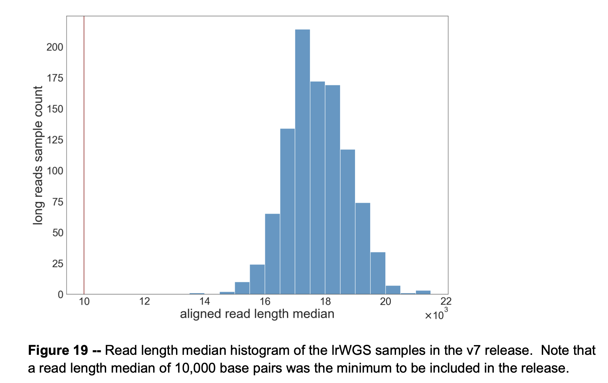
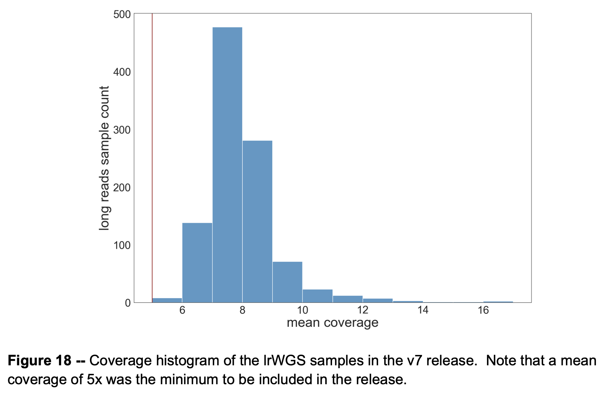

# Haplotype Threading Lab Notebook

The goal of this project is to determine if parts of the human pangenome are associated with certain traits. Kind of like a GWAS except instead of SNPs we will use paths of a pangenome.

We have to answer several questions first though:

1. Can we associate each individual with a specific path through a pangenome via alignment.
2. Can we break up those paths into chunks that make sense and can be associated with a trait via GWAS?

For this directory I'm copying the project structure reccomended by [this paper](https://journals.plos.org/ploscompbiol/article?id=10.1371/journal.pcbi.1000424) roughly.

Log syntax
```bash
function TIMESTAMP () { echo $(TZ=US/Pacific; date '+%Y-%m-%d_%H-%M-%S'); }
[command] 2>&1 | tee results/[out_date]/[name]_$(TIMESTAMP).log
```

All commands in this file will be from the root of the git repo haplotype-threading. Also, `./bin` is prepended to my PATH. 

## 2024-08-27 Compare minigraph and graphaligner

Working on tscc.

```bash
OUTPUT=results/2024-08-27
```

We have two graph alignment tools: `minigraph` and `graphaligner` and I want to test them on a trivial base case to see if one performs better than the other. So I'm going to test aligning GRCh38 to v1.1 of the hprc minigraph-cactus graph as it was used to generate the graph and should have a near perfect alignment.

We will compare the tools: runtime and alignment accuracy and the output files types

### Subset graph and grch38 to a loci
This is required to have any reasonable runtime. We'll choose two different regions so that we can have one control.

I highly complex region from [here](https://github.com/CAST-genomics/snakemake-gfa-complexity/blob/main/highly_complex_regions) and a simple region from another analysis of the same size.

- Complex Region: chr1:16478848-16878847
- Simple Region:  chr4:107201506-107601505

Linear reference genome at simple region is entirely N's.

```bash
# Subset graph
gfabase sub data/hprc-v1.1-mc-grch38.gfab --range GRCh38#chr1:16478848-16878847 --view -o $OUTPUT/chr1:16478848-16878847.gfa

gfabase sub data/hprc-v1.1-mc-grch38.gfab --range GRCh38#chr4:107201506-107601505 --view -o $OUTPUT/chr4:107201506-107601505.gfa

# Subset linear reference genome
samtools faidx data/hg38.fa chr1:16478848-16878847 > $OUTPUT/chr1:16478848-16878847.fa

samtools faidx data/hg38.fa chr4:107201506-107601505 > $OUTPUT/chr4:107201506-107601505.fa
```

We can try subsampling sequences as well using pbsim, if it is neccessary.

#### graphaligner:
Graphs must be in gfa or vg file formats. I'm skeptical that this will be efficient. 

Has several required parameters:
- `precise-clipping` is the minimum sequence similarity for an alignment before it's tossed, has suggested values
- `-x vg` is variation graph defaults, `-x dbg` for de Brujin graphs. In general the de Brujin graphs are more complex so may fit a large pangenome use case better.

```bash
conda create -n haplotype-threading
conda activate haplotype-threading
conda install -c bioconda graphaligner

GraphAligner -g $OUTPUT/chr1:16478848-16878847.gfa -f $OUTPUT/chr1:16478848-16878847.fa -t 2 -a $OUTPUT/hg38_v1.1-mc-grch38.gam --precise-clipping 0.95 -x dbg 2>&1 | tee $OUTPUT/logs/chr1tochr1-graphaligner_$(TIMESTAMP).log

GraphAligner -g $OUTPUT/chr4:107201506-107601505.gfa -f $OUTPUT/chr4:107201506-107601505.fa -t 2 -a $OUTPUT/hg38_v1.1-mc-grch38.gam --precise-clipping 0.95 -x dbg 2>&1 | tee $OUTPUT/logs/chr4-correct-alignment_$(TIMESTAMP).log

GraphAligner -g $OUTPUT/chr4:107201506-107601505.gfa -f $OUTPUT/chr1:16478848-16878847.fa -t 2 -a $OUTPUT/hg38_v1.1-mc-grch38.gam --precise-clipping 0.95 -x dbg 2>&1 | tee $OUTPUT/logs/chr4tochr1-alignment_$(TIMESTAMP).log
# 24,747 / 40,000 bases aligned --> no alignment

GraphAligner -g $OUTPUT/chr1:16478848-16878847.gfa -f $OUTPUT/chr4:107201506-107601505.fa -t 2 -a $OUTPUT/hg38_v1.1-mc-grch38.gam --precise-clipping 0.95 -x dbg 2>&1 | tee $OUTPUT/logs/chr1tochr4-alignment_$(TIMESTAMP).log
# 16,201 / 40,000 bases aligned --> no alignment

conda deactivate
```
All process instantly.

#### minigraph:

Default `-x asm` exists for assemblies. Should also test `lr` for long reads.

```bash
git submodule add https://github.com/lh3/minigraph src/minigraph
cd src/minigraph; make; 
cp minigraph ../../bin/; cd ../..

minigraph -x asm $OUTPUT/chr1:16478848-16878847.gfa $OUTPUT/chr1:16478848-16878847.fa -t 4 > $OUTPUT/chr1tochr1-minigraph.gaf 2> >(tee $OUTPUT/logs/chr1tochr1-minigraph_$(TIMESTAMP).log >&2)
# Takes about 24 seconds, 3 different alignments, 1 the total length + 2 others 50% length. Found more than graphaligner due to lower threshold

minigraph -x asm $OUTPUT/chr4:107201506-107601505.gfa $OUTPUT/chr4:107201506-107601505.fa -t 4 > $OUTPUT/chr4tochr4-minigraph.gaf 2> >(tee $OUTPUT/logs/chr4tochr4-minigraph_$(TIMESTAMP).log >&2)
# Takes 5 seconds, 1 sequence aligned, almost all bases mapped

minigraph -x asm $OUTPUT/chr1:16478848-16878847.gfa $OUTPUT/chr4:107201506-107601505.fa -t 4 > $OUTPUT/chr1tochr4-minigraph.gaf 2> >(tee $OUTPUT/logs/chr1tochr4-minigraph_$(TIMESTAMP).log >&2)
# Instant, no alignments found

minigraph -x asm $OUTPUT/chr4:107201506-107601505.gfa $OUTPUT/chr1:16478848-16878847.fa -t 4 > $OUTPUT/chr4tochr1-minigraph.gaf 2> >(tee $OUTPUT/logs/chr4tochr1-minigraph_$(TIMESTAMP).log >&2)
# Instant, no alignments found
```

### Test Alignments with simulated sequences

Use pbsim3 for simulating long reads from a reference genome.

```bash
git submodule add https://github.com/yukiteruono/pbsim3 src/pbsim3
cd src/pbsim3; ./configure; make
cp src/pbsim ../../bin/; cd ../..

# Long reads are low coverage in All of Us
pbsim --prefix $OUTPUT/simulated_chr4 \
      --seed 1 \
      --strategy wgs \
      --genome $OUTPUT/chr4:107201506-107601505.fa \
      --depth 8 \
      --errhmm src/pbsim3/data/ERRHMM-RSII.model \
      --method errhmm src/pbsim3/data/ERRHMM-RSII.model \
      2>&1 | tee $OUTPUT/logs/simulated_chr4_$(TIMESTAMP).log

pbsim --prefix $OUTPUT/simulated_chr1 \
      --seed 1 \
      --strategy wgs \
      --genome $OUTPUT/chr1:16478848-16878847.fa \
      --depth 8 \
      --errhmm src/pbsim3/data/ERRHMM-RSII.model \
      --method errhmm src/pbsim3/data/ERRHMM-RSII.model \
      2>&1 | tee $OUTPUT/logs/simulated_chr1_$(TIMESTAMP).log

```

***#Idea*** 
This produces .fastq, .maf, and .ref files that can be used with a tool like quast once you generate a .bam to quantify the accuracy of the alignment. But no such tool exists for .gaf/.gam files yet. This is something we could build.

Alignment tools take in fasta files not fastqs so we have to convert them

```bash
sed -n '1~4s/^@/>/p;2~4p' $OUTPUT/simulated_chr4_0001.fastq > $OUTPUT/simulated_chr4.fa
sed -n '1~4s/^@/>/p;2~4p' $OUTPUT/simulated_chr1_0001.fastq > $OUTPUT/simulated_chr1.fa
```

#### graphaligner
Need vg to view graphaligner .gam files

```bash
wget https://github.com/vgteam/vg/releases/download/v1.59.0/vg
chmod +x vg; mv vg bin

vg view -a [path_to_.gam]
```
vg view -a 
```bash
conda activate haplotype-threading

GraphAligner -g $OUTPUT/chr1:16478848-16878847.gfa -f $OUTPUT/simulated_chr1.fa -t 2 -a $OUTPUT/hg38_v1.1-mc-grch38.gam --precise-clipping 0.75 -x dbg -a $OUTPUT/simalignment_graphaligner_chr1tochr1.gam 2>&1 | tee $OUTPUT/logs/simalignment_graphaligner_chr1tochr1_$(TIMESTAMP).log
# 291/353 reads with an alignment
# 3395901/3200047 input bps aligned.
# 88 end to end alignments (851714bp)
# 2 seconds

GraphAligner -g $OUTPUT/chr4:107201506-107601505.gfa -f $OUTPUT/simulated_chr4.fa -t 2 -a $OUTPUT/hg38_v1.1-mc-grch38.gam --precise-clipping 0.75 -x dbg -a $OUTPUT/simalignment_graphaligner_chr4tochr4.gam 2>&1 | tee $OUTPUT/logs/simalignment_graphaligner_chr4tochr4_$(TIMESTAMP).log
# 317/342 reads with an alignment
# 4568702/3200052 input bps aligned
# 77 end to end alignments
# 2 seconds

GraphAligner -g $OUTPUT/chr4:107201506-107601505.gfa -f $OUTPUT/simulated_chr1.fa -t 2 -a $OUTPUT/hg38_v1.1-mc-grch38.gam --precise-clipping 0.75 -x dbg -a $OUTPUT/simalignment_graphaligner_chr1tochr4.gam 2>&1 | tee $OUTPUT/logs/simalignment_graphaligner_chr1tochr4_$(TIMESTAMP).log
# 209/353 reads with an alignment
# 98457/3200047 input bps aligned
# 0 end to end alignments
# instant

GraphAligner -g $OUTPUT/chr1:16478848-16878847.gfa -f $OUTPUT/simulated_chr4.fa -t 2 -a $OUTPUT/hg38_v1.1-mc-grch38.gam --precise-clipping 0.75 -x dbg -a $OUTPUT/simalignment_graphaligner_chr4tochr1.gam 2>&1 | tee $OUTPUT/logs/simalignment_graphaligner_chr4tochr1_$(TIMESTAMP).log
# 186/342 read with alignment
# 87838/3200052 bps aligned
# 0 end to end alignments
# instant

conda deactivate
```
Correctly makes 0 alignments in the wrong region. 

But only correctly maps a small portion of the reads. Seems like it might struggle with low quality assemblies or reads.

If some reads can pass through multiple paths in a bubble, we have repeated alignments when one read passes through one location.

#### minigraph

```bash
minigraph -x lr $OUTPUT/chr1:16478848-16878847.gfa $OUTPUT/simulated_chr1.fa -t 4 > $OUTPUT/simalignment_minigraph_chr1tochr1.gaf 2> >(tee $OUTPUT/logs/simalignment_minigraph_chr1tochr1_$(TIMESTAMP).log >&2)
# 1.5 seconds
# mapped 265/353 reads

minigraph -x lr $OUTPUT/chr4:107201506-107601505.gfa $OUTPUT/simulated_chr4.fa -t 4 > $OUTPUT/simalignment_minigraph_chr4tochr4.gaf 2> >(tee $OUTPUT/logs/simalignment_minigraph_chr4tochr4_$(TIMESTAMP).log >&2)
# 1 second
# mapped 302/342 reads

minigraph -x lr $OUTPUT/chr1:16478848-16878847.gfa $OUTPUT/simulated_chr4.fa -t 4 > $OUTPUT/simalignment_minigraph_chr4tochr1.gaf 2> >(tee $OUTPUT/logs/simalignment_minigraph_chr4tochr1_$(TIMESTAMP).log >&2)
# instant
# mapped 3/342 reads

minigraph -x lr $OUTPUT/chr4:107201506-107601505.gfa $OUTPUT/simulated_chr1.fa -t 4 > $OUTPUT/simalignment_minigraph_chr1tochr4.gaf 2> >(tee $OUTPUT/logs/simalignment_minigraph_chr1tochr4_$(TIMESTAMP).log >&2)
# instant
# 17/353 reads
```

Minigraph doesn't actually calculate any base pair level alignments. It just finds seeds and then maps reads to gfa segments. According to their paper this means they are slightly worse at determining which path a read is on, but faster and better at determining the general loci a read is placed at.

### Summary
graphaligner allows partial alignments of reads and allows reads to align in multiple locations. It also gives per base level alignments. But it was slightly less accurate the minigraph at actually determining the correct loci for a read.

minigraph aligns each read at one location and only gives the segments that it believes the path travels. We might be over-confident, then, that some high accuracy alignment is actually the best.

### Conclusion
I'm inclined to favor graphaligner in a vacuum because we can use the multiple alignments to decide to drop certain reads and maintain a really high accuracy.

In an ideal world the best method might be to map all reads to the pangenome by minigraph to determine the correct loci. Then on a per-loci level use graphaligner to determine the specific paths favored.

Next steps will be to try using graphaligner on the All of Us portal.

## 2024-08-28

```bash
OUTPUT=results/2024-08-28
```

Working on All of Us researcher workbench. I want to thread long read assemblies through the human pangenome using graphaligner.

1. The assemblies will be computationally the simplest, but they are built on 8x coverage hifi, so the assemblies likely have many errors. So instead using the raw reads is probably better.
2. We should align to a section of the genome too, rather than the whole thing at once. This will definitely get better results.

### Notes for working on All of Us

- [v7 Genomic Quality Report](https://support.researchallofus.org/hc/en-us/articles/4617899955092-All-of-Us-Genomic-Quality-Report-ARCHIVED-C2022Q4R9-CDR-v7) -- methods for how data was processed is described here too.
- [Controlled CDR Data Directory](https://support.researchallofus.org/hc/en-us/articles/4616869437204-Controlled-CDR-Directory)
- [Genomic Data Organization Overview](https://support.researchallofus.org/hc/en-us/articles/4614687617556-How-the-All-of-Us-Genomic-data-are-organized#h_01GY7QVTF0E3TKJSFAN40ZTY2Y)

Figures from Quality Report
Long Read Length Distribution:

Long Read Coverage Distribution:



Potentially useful `env` variables to check out:
```
HG38_REFERENCE_DICT=gs://genomics-public-data/references/hg38/v0/Homo_sapiens_assembly38.dict
WORKSPACE_NAMESPACE=aou-rw-d9c60d7d
WORKSPACE_BUCKET=gs://fc-secure-f6524c24-64d9-446e-8643-415440f52b46
WGS_LONGREADS_HAIL_GRCH38_PATH=gs://fc-aou-datasets-controlled/v7/wgs/long_read/hail.mt/GRCh38
HG38_REFERENCE_FASTA=gs://genomics-public-data/references/hg38/v0/Homo_sapiens_assembly38.fasta
LONG_READS_MANIFEST_PATH=gs://fc-aou-datasets-controlled/v7/wgs/long_read/manifest.csv
WGS_LONGREADS_JOINT_SNP_INDEL_VCF_T2T_PATH=gs://fc-aou-datasets-controlled/v7/wgs/long_read/joint_vcf/T2T
WGS_LONGREADS_HAIL_T2T_PATH=gs://fc-aou-datasets-controlled/v7/wgs/long_read/hail.mt/T2T
HG38_REFERENCE_FAI=gs://genomics-public-data/references/hg38/v0/Homo_sapiens_assembly38.fasta.fai
WGS_LONGREADS_JOINT_SNP_INDEL_VCF_GRCH38_PATH=gs://fc-aou-datasets-controlled/v7/wgs/long_read/joint_vcf/GRCh38
```

***Long Read Auxiliary Information***
```
Aux (grch38_noalt)
gs://fc-aou-datasets-controlled/v7/wgs/long_read/aux/auxiliary_metrics.GRCh38.tsv

Aux (T2Tv2.0)
gs://fc-aou-datasets-controlled/v7/wgs/long_read/aux/auxiliary_metrics.T2T.tsv
```

To run jobs write script in WDL, use cromshell to launch those jobs, and use a custom python script to launch cromshell.
- [example repo](https://github.com/CAST-genomics/cast-workflows/tree/gnomix/local_ancestry)
- [cromshell repo](https://github.com/broadinstitute/cromshell)

Misc AoU Tips
- Use `set -e` in all WDL tasks so that things don't blow up.
- `-u ${GOOGLE_PROJECT}` - required for requester pays buckets
- `--billing-project ${GOOGLE_PROJECT}` - sometimes this works instead
- `${WORKSPACE_BUCKET}` - google cloud bucket for all files. 

Misc Cromshell Tips
```
# Check status of wdl tasks
cromshell status [id]

# Show logs, this one probably is slightly incorrect
cromshell logs -s ALL [id]

# Get all metadata for each ran task. -t increases timeout limit
cromshell -t 200 (timeout limit) metadata [id]

# Get output file names, dj do something.
cromshell list-outputs -dj? [id]

# Use -help with any cromshell command to get more info.
```

gcloud storage help page:
```
gcloud storage [command]
      cat                     Outputs the contents of one or more URLs to
                              stdout.
      cp                      Upload, download, and copy Cloud Storage objects.
      du                      Displays the amount of space in bytes used up
                              storage resources.
      hash                    Calculates hashes on local or cloud files.
      ls                      List Cloud Storage buckets and objects.
      mv                      Moves or renames objects.
      rm                      Delete objects and buckets.
      rsync                   Synchronize content of two buckets/directories.
      service-agent           Manage a project's Cloud Storage service agent,
                              which is used to perform Cloud KMS operations.
      sign-url                Generate a URL with embedded authentication that
                              can be used by anyone.
```

### Finding file paths on All of Us

**Column Headers for long reads manifest path**
```
gcloud storage --billing-project ${GOOGLE_PROJECT} cat $LONG_READS_MANIFEST_PATH  | head -n 1 | sed 's/,/\n/g'

research_id

hifiasm-primary-asm-fasta
hifiasm-hap1-asm-fasta
hifiasm-hap2-asm-fasta

hifiasm-primary-asm-gfa
hifiasm-hap1-asm-gfa
hifiasm-hap2-asm-gfa

hifiasm-quast-report-html
hifiasm-quast-report-summary

chm13v2.0-pav-vcf
chm13v2.0-pav-tbi
chm13v2.0-bam
chm13v2.0-bai
chm13v2.0-pbi
chm13v2.0-haplotagged-bam
chm13v2.0-haplotagged-bai

chm13v2.0-deepvariant-vcf
chm13v2.0-deepvariant-tbi
chm13v2.0-deepvariant-phased-vcf
chm13v2.0-deepvariant-phased-tbi
chm13v2.0-pbsv-vcf
chm13v2.0-pbsv-tbi
chm13v2.0-sniffles-vcf
chm13v2.0-sniffles-tbi
chm13v2.0-sniffles-snf

grch38-pav-vcf
grch38-pav-tbi
grch38-bam
grch38-bai
grch38-pbi
grch38-haplotagged-bam
grch38-haplotagged-bai

grch38-deepvariant-vcf
grch38-deepvariant-tbi
grch38-deepvariant-phased-vcf
grch38-deepvariant-phased-tbi
grch38-pbsv-vcf
grch38-pbsv-tbi
grch38-sniffles-vcf
grch38-sniffles-tbi
grch38-sniffles-snf
```
Breakdown:
- `pav` is a phasing tool.
- `haplotagged`indicates each read is assigned to a parental haplotype based on the alleles present.
- `deepvariant`, `sniffles`, and `pbsv` are SV callers. In general sniffles performs the best, but they are unique calls made by all 3 tools.
- `quast` is a tool that rates the quality of a given assembly.
- `hifiasm` is a tool that generates assemblies from reads.

**Questions:**
1. Why are we storing assemblies in GFAs?
2. Why do we have primary, hap1, and hap2 assemblies? There should be only 2 total.

Read some papers and documentation and looked into the data to arrive at the below conclusions.

**Answers:**
1. Each GFA contains every contig as a segment, then several A or assembly lines described [here](https://github.com/chhylp123/hifiasm/issues/91). The assembly lines describe where and how each read aligns to each contig. So the gfa file describes the relationship between the assemblies and the reads. Reads can be assigned to both haplotypes but in many cases where the haplotypes diverge, they are not. The fasta files are then generated from the GFAs.
2. The assemblies are generated using hifiasm. The primary assembly uses all reads, whereas the phased assemblies use only portions. [Paper for more info.](https://www.nature.com/articles/s41592-020-01056-5). The primary assembly tends to be higher quality by reviewing the auN metrics from quast. But because it swaps between both haplotypes it may not be as useful for our purpose. Based on a few n90 numbers, so long as our region of interest is alignable by haplotigs of length 40kb we should prefer the phased assemblies.

I also found [the GitHub](https://github.com/broadinstitute/long-read-pipelines/tree/main) of all pipelines used to generate long-read data for AoU.

## 2024-08-29

### set up all of us environment:

Added utils stolen from [Dr. Gymrek's cast-workflows](https://github.com/CAST-genomics/cast-workflows/tree/gnomix/utils).

```bash
git clone --recurse-submodules https://github.com/WillardFord/haplotype-threading; cd haplotype-threading

# minigraph
cd src/minigraph; make; 
cp minigraph ../../bin/; cd ../..

# graphaligner
conda create -n haplotype-threading graphaligner -c bioconda
conda activate haplotype-threading

# GRCh38 Pangenome
wget https://s3-us-west-2.amazonaws.com/human-pangenomics/pangenomes/freeze/freeze1/minigraph-cactus/hprc-v1.1-mc-grch38/hprc-v1.1-mc-grch38.gfa.gz; mv hprc-v1.1-mc-grch38.gfa.gz data/

python src/utils/configure_cromshell.py
```

I have to make some dockers for the wdl tasks.
This works but I'm not sure how to actually upload the image to dockerhub or google cloud so that it can be used on All of Us.
```
docker build -t minigraph:latest -f src/align_reads/dockerfiles/Dockerfile.minigraph .
```

## 2024-08-30

```bash
OUTPUT=results/2024-08-30
```

HPRC Assemblies are in pangenome. Are CHM13Y and GRCH38?

HPRC assemblies will be used as a ground truth. Next steps look like:
1. Align all HPRC assemblies to pangenome
2. Pull out the paths from the output files, (store as GBZ files perhaps)
3. Score them against known paths from pangenome to determine quality of alignments

(repeat for long-reads, repeat for short-reads)

**Question:** Should we be using the minigraph-cactus version of the pangenome or the minigraph version.
- minigraph has less nodes and will likely run faster
- TODO: need to read cactus paper and minigraph-cactus pipline paper and probably ask Dr. Gymrek

### Download HPRC Assemblies

The HPRC assemblies are most efficiently stored in (AGC files)[https://github.com/human-pangenomics/HPP_Year1_Assemblies]. There is also a list of contigs that are likely contamination that we should filter out.

Collect them using comands below:
```bash
wget -O data/HPRC-yr1.agc https://zenodo.org/records/5826274/files/HPRC-yr1.agc?download=1
wget -O data/y1_genbank_remaining_potential_contamination.txt https://raw.githubusercontent.com/human-pangenomics/HPP_Year1_Assemblies/main/genbank_changes/y1_genbank_remaining_potential_contamination.txt

# download precompiled AGC binary for Linux
curl -L https://github.com/refresh-bio/agc/releases/download/v1.1/agc-1.1_x64-linux.tar.gz | tar -zxvf - agc-1.1_x64-linux/agc; cp agc-1.1_x64-linux/agc bin/; rm -rf agc-1.1_x64-linux
```

AGC useful commands:
```bash
# List all assembly ids
agc listset data/HPRC-yr1.agc | wc -l
95

# Get fasta to stdout of assembly id
agc getset data/HPRC-yr1.agc NA18906.1 | less -S
```

Contig naming convention: {sample_id}#{haplotype}#original_contig_id
In assembly id and in original_contig_id, trailing `.1` indicates paternal haplotype and `.2` indicates maternal haplotype.

### Write slurm script to align all HPRC assemblies to the pangenome

```bash
mkdir results/2024-08-30_HPRC_minigraph_alignments
sbatch src/align_assembly/slurm/minigraph_align.slurm
# Check progress
squeue -u [username]
```

This script generates `.gaf` alignments of all assemblies in `data/HPRC-yr1.agc` to the full HPRC minigraph-cactus pangenome at `data/hprc-v1.1-mc-grch38.gfa`. 

### Misc Notes on minigraph-cactus vs minigraph

- minigraph intentionally discards any variants less than 50bps. This means that paths through minigraph for a given haplotype intentionally don't exist because they cannot be represented without losing significant variation.
- minigraph cactus reintroduces these smaller variants in a subsequent step performing multiple alignment at a base pair level of all haplotypes used to generate the graph in the first place. These alignments are then reduced in some way with cactus (Need some help understanding) and then used to make a new graph.
- This new graph then has any structural variants not in minigraph clipped out as likely errors and is the default minigraph-cactus graph in HPRC. 
- They also generated another graph by removing nodes that have fewer than N haplotypes and suggest suggest the allele-frequency filtered graph is better for short read mapping and variant calling. These are the graphs that vg Giraffe has used as input. In my own experimentation a huge portion of the nodes had very few haplotypes passing through them so this likely reduced the size of the graph by a lot, but I'm skeptical if removing spurious alignments didn't also remove many correct alignments.
- The main advantage of minigraph cactus is that every haplotype is represented by a path through the graph, whereas in minigraph you are losing many, many small variations.
- minigraph-cactus has ~200x as many nodes as minigraph
- CHM13 performs slightly better than grch38, especially localized to specific regions that are "falsely duplicated or collapsed" in grch38. TODO: what are these faulty regions in the reference genome?
- Challenging Medically Relevant Genes (CRMG) Truth Set


Tools to review more about:
- Pangenie - Structural Variant Genotyping tool based on short reads, hmm, alignment free
- Girraffe - Short read alignment tool to a pangenome

Do we care about small variants?
- deep variant - also does long
- free bayes - second choice of HPRC consortium without properly trained deep variant model

## 2024-09-11

Alignment script for graphaligner

```bash
sbatch src/align_assembly/slurm/graphaligner.slurm
watch squeue -u [username]
```

Aligning an assembly to the whole genome doesn't work nicely.

For minigraph it takes more than 8 hours so it dies on the condo nodes, it may work if we let it run for a day+. With only 25 GB of memory we didn't have any issues.

For graphaligner, slurm kept killing the job due to running out of space. It was able to load the graph in memory but during the alignment step it eventually runs out of memory even when given 128 GB of memory. Memory use seems to scale with the size of the input.

Then we probably have to segment the pangenome graph and/or the assembly first. Tomorrow we will try segmenting both.

## 2024-09-12

### Align only a segment of the assembly to a subset pangenome

**Segment the pangenome with gfabase**
I already have gfabase binary installed in my path elsewhere
```
gfabase --version
# gfabase 0.6.0

gfabase sub data/hprc-v1.1-mc-grch38.gfab --range GRCh38#${CHROM}:${START}-${END} --view -o ${TEMP_GFA}
gfabase sub data/hprc-v1.1-mc-grch38.gfab --range GRCh38#${CHROM}:${START}-${END} --view -o ${TEMP_GFA}

```

**Segment the assemblies with gfabase**

1. Filter out bad contigs of assembly
2. Align assembly to GRCh38 -- minimap2
3. Pull out segment from assembly corresponding to GRCh38 range -- samtools

I already have samtools in my path elsewhere

Download minimap2
``` bash
git submodule add https://github.com/lh3/minimap2 src/minimap2
cd src/minimap2 && make
cd ../.. && cp src/minimap2/minimap2 bin
minimap2 --version
# 2.28-r1209
```

This following script takes in 3 variables `CHROM`,`START`, and `END` that define a range within GRCh38. Then, for each of the 95 haplotypes used to generate the Human Pangenome, it does the following:
1. Save and clean the haplotype from HPRC -- dropping suggested contaminated haplotigs
2. Align haplotype to GRCh38 -- minimap2 asm to asm
3. Subset haplotigs to only those overlapping the region in GRCh38 -- samtools view
4. Subset Human Pangenome to overlapping nodes in GRCh38 -- gfabase sub
5. Align kept haplotigs to subsetted pangenome -- minigraph


``` bash
# HLA_REGION is within chr6:29742532-30245870
sbatch --export=CHROM=chr6,START=29742532,END=30245870 src/align_assembly/slurm/subset_minigraph_align.slurm
```

Note: long-reads are often given the flag `supplementary` because different parts map to different locations on the reference genome. This is usually an indication of an error but in a structural variant region this is can be expected behaviour for individuals of different ancestry than hg38 a specific locus. `samtools fasta` does not include any reads with the supplementary flag so we use awk instead to keep all reads. This needs to be looked more into however to be sure. # TODO

Note: Cleaning haplotype everytime is excessive, we could save the file in this directory.

## 2024-09-13

TODO:
1. Only segmenting the pangenome will probably lead to more accurate results. Segmenting the contigs/reads to align is probably only neccessary when dealing with many reads, not when working with a single assembly.
2. Generate the same script for graphaligner
3. Try on many regions of interest

**Questions:**
1. How can we turn a set of haplotype-pangenome alignments into called variants so that we can actually perform gwas-esque studies. Are we using nodes alone or are we generating bubbles from the nodes. `minigraph` has a variant calling feature on a gfa that we could build around our kept nodes but we should look more into other options. 
2. When we eventually get to short-reads giraffe aligner is designed for short reads, though I need to do a bit more thorough review.

### Segment only the GFA and align the entire haplotype

``` bash
sbatch --export=CHROM=chr6,START=29742532,END=30245870 src/align_assembly/slurm/subset_gfa_minigraph_align.slurm
```

This provides many, many spurius alignments, Doesn't seem like an effective way to move forward.